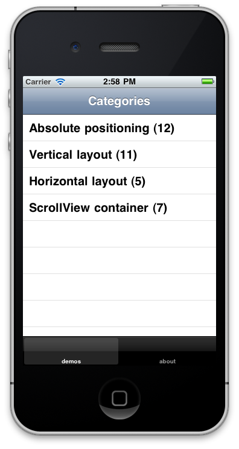

###The problem

During a recent app project, I felt constantly hampered by not having a strong enough ninjutsu understanding of laying out things in a Titanium app. How does horizontal and vertical layout actually work? What&#8217;s the difference between a View, a ScrollView and a ScrollableView? When having too much content to show on screen, do I want the parent or child to scroll? What happens when I have a scrolling child in a scrolling parent?

I constantly had to pause my work to peruse the Titanium docs/kitchensink/sourcecode, or (more often) do some experimenting on the side, regarding stuff that I suspected I really should have nailed down. It felt like doing maths without having memorized the multiplication tables!

###The TiView app

Eventually the added-up frustration got too great, so I set aside some time for grokking and getting comfortable with the API. This resulted in a small Titanium application we call **TiView**. It has a number of demos, showing on screen what various layout properties will actually result in. Most of it probably already obvious to most of you out there, but I felt it helped me to &#8220;say it out loud&#8221; in this way.

As stated the app is very simple. It has a number of demos, ordered into categories. The screenshot below shows the current content, I hope to add some more to it before I move on too far:



Each category then consists of a ScrollableView, where each view is a demo of some layout code. The properties used are displayed inside the laid-out child:


The source code is available in the Git repo [here](http://github.com/krawaller/tiview). Have a snoop and see if might be of any help. Or even better, add more demos of your own! It&#8217;s just 250 lines in a single file, and all the demos are just object literals sent into a constructor function, so getting your own ideas in there shouldn&#8217;t require that strong a shoe-horn:

```javascript
demos = [{
	description: "A parent with the layout property set to vertical uses a vertical layout mechanism instead. Here, a child is placed in relation to the bottom of the previous child.",
	children: [{height:80,width:100,left:30},{top:5,left:20,height:80,width:60}]
},{
	iphone: "Everything works as normal, even negative offsets (not on Android though!) and zIndexes. Except...",
	android: "Negative top offsets have weird behaviour in a vertical layout on Android. Here, the second child ends up before the first!",
	children: [{height:80,width:100,left:30,zIndex:1},{top:-5,left:20,height:80,width:60}]
},{
	iphone: "...the top and bottom properties are both used as margins (on Android only top!). So the height difference between two siblings is the sum of the bottom of the first and the top of the second.",
	android: "The height difference between two siblings is controlled by the top property of the second sibling. On iPhone, the bottom prop of the first is added to the difference as well.",
	children: [{height:80,width:100,left:10,bottom:10},{top:10,left:20,height:80,width:60}]
},{
	description: "The top property of the first child offsets it in relation to the parent. The bottom property of the last child is simply ignored.",
	children: [{top:5,height:80,width:100,left:30},{top:10,left:20,height:80,width:100,bottom:500}]
}];
```

###Android VS iPhone

When we ran the app on an Android, it turned out that there where even more difference in behaviour between the platforms that we had originally thought! Therefore we gave the demos platform-specific descriptions.

This process was hugely informative for us - not only did we gain a better understanding of the layout API:s, but also of the (many) differences between the platforms! Having a good map of these differences will make it much easier to write code that won&#8217;t behave differently on the other platform.

So we encourage you to try out TiView, and hope it will be of use!

