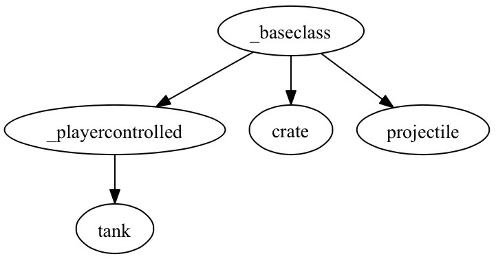

A few weekends ago, I got to shut myself in with my two brothers and a few friends in the Spotify Gothenburg office. Counterstrike, Nerf gun wars, FIFA tournaments and male bonding ensued! Most importantly, we had a night-long hack trying out Impact for the first time. So much fun!!

As weekends have an unfortunate habit of ending we didn't get too far (also the constant temptation of another CS round didn't help), but leaving the office we did have a working prototype of a classic (same-computer) multiplayer tank game. We built with Impact and Box2D, a very nice although woefully undocumented marriage.

Our little game is woefully simple and light years from completion, but with features like respawn, grace, reload time and recoil, it still feels like the start of something!


Live link [here](http://krawaller.github.io/kratankpubl/live), repo [here](https://github.com/krawaller/kratankpubl) (although with minified impact source, as per the license). Only the green tank can actually fire, which gives him an ever so slight advantage...

### Code

We used the Box2D tutorial [top down car physics](https://www.iforce2d.net/b2dtut/top-down-car) as a starting point. It is in java and uses a different Box2D version so it took us a while to get up and running.

Here's a quick rundown of the code in the repo:

#### Brains

The files that make up the non-impact parts of the game (i.e, what we wrote) is all in the [live/lib/game](https://github.com/krawaller/kratankpubl/tree/gh-pages/live/lib/game) folder. This folder contains 3 files:

*    [player.js](https://github.com/krawaller/kratankpubl/blob/gh-pages/live/lib/game/player.js) is our abstraction for a person playing the game (not a tank, but the person controlling the tank). Here we put code for spawning and losing tanks, score, etc.
*    [main.js](https://github.com/krawaller/kratankpubl/blob/gh-pages/live/lib/game/main.js) is the standard Impact entry point. It loads all dependencies, initiates Player objects and makes the spawn a tank each.
*    [data.js](https://github.com/krawaller/kratankpubl/blob/gh-pages/live/lib/game/data.js) is really just a JSON file of settings for tanks and guns. Plan was to extend this object if in the future we add different kinds of tanks, but for now there's just the one.

#### Objects

There are also 5 files in an [entities](https://github.com/krawaller/kratankpubl/tree/gh-pages/live/lib/game/entities) folder, who fit together like thus:



These files do pretty much what you'd think:

*    The [_baseclass.js](https://github.com/krawaller/kratankpubl/blob/gh-pages/live/lib/game/entities/_baseclass.js) file contains the basic stuff needed for an entity to exist in the world, setting up collision etc.
*    [_playercontrolled.js](https://github.com/krawaller/kratankpubl/blob/gh-pages/live/lib/game/entities/_playercontrolled.js) sets up controls and ties the entity to a player object. It also contains health bar code, which should probably be abstracted out to a `_destructible.js` baseclass.
*    [tank.js](https://github.com/krawaller/kratankpubl/blob/gh-pages/live/lib/game/entities/tank.js) are of course the actual tanks. They mostly contain shooting code.
*    [projectile.js](https://github.com/krawaller/kratankpubl/blob/gh-pages/live/lib/game/entities/projectile.js) destroys itself if off screen, and catches collision notification from box2D. If target is a tank (or in the future a `_destructible`), it deals damage and destroys itself.
*    [crate.js](https://github.com/krawaller/kratankpubl/blob/gh-pages/live/lib/game/entities/crate.js) just sets some initiation stuff such as weight and mass, and then does nothing else.

The main challenge was deciphering the java code from the tutorial that compensates for lateral velocity:

```java
b2Vec2 getLateralVelocity() {
  b2Vec2 currentRightNormal = m_body->GetWorldVector( b2Vec2(1,0) );
  return b2Dot( currentRightNormal, m_body->GetLinearVelocity() ) * currentRightNormal;
}

void updateFriction() {
  b2Vec2 impulse = m_body->GetMass() * -getLateralVelocity();
  m_body->ApplyAngularImpulse( 0.1f * m_body->GetInertia() * -m_body->GetAngularVelocity() );
}
```

Here's what we ended up with, in case someone wants to make the same java-javascript transition we did:

```javascript
getLateralCounterForce(){
    var vector = new Box2D.Common.Math.b2Vec2(0,1),
        currentRightNormal = this.body.GetWorldVector(vector),
        linearVel = this.body.GetLinearVelocity(),
        dot = Box2D.Common.Math.b2Math.Dot(currentRightNormal,linearVel);
    currentRightNormal.Multiply(-dot*this.body.GetMass()*(this.lateralCounterForceFactor||1));
    return currentRightNormal;
}
```

### Box2D

Box2D is included as a plugin to Impact. The main hooks into Impact are in [collision.js](https://github.com/krawaller/kratankpubl/blob/gh-pages/live/lib/plugins/box2d/collision.js), a file we had to 
modify rather heavily to get stuff working the way we wanted.

