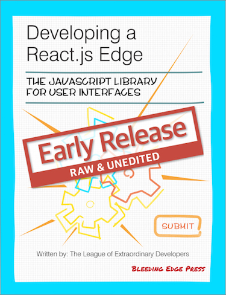

For the last couple of weeks I've been enjoying the [O'Reilly early release](http://shop.oreilly.com/product/9781939902122.do) of the upcoming [Developing a React.JS Edge](http://bleedingedgepress.com/developing-react-js-edge/) (DaRE) from Bleeding Press.

Opening the book I had rather low expectations - a previous effort in the same series [left me wanting](https://blog.krawaller.se/posts/book-review-developing-a-backbone-js-edge/), and also I arrogantly thought myself to have ascended well above the knowledge generally provided by entry-level books like this. Turns out I was wrong on both accounts!

Although the book is still in early release and as such isn't finished (nor is the [accompanied example app](https://github.com/rtfeldman/bleeding-edge-sample-app)), I still wanted to share some thoughts on it as I'm already seriously impressed.

###Nose to ground ratio

One of my foremost pet peeves with tech books is when the author's nose is barely above the ground, i.e. he's reiterating the tech API with some added commentary. This easily makes the book uninteresting, short-lived and unrewarding. DaRE absolutely has some API chanting but it's kept on a very sane level, and always done in a context that drives home a bigger point.

Throughout DaRE gives lots of space to the *why* and not just the *how*, which in my opinion is the raison d'&ecirc;tre for books. If I want anything else I'll read the official docs or a blog post, but to convey deeper understanding of a problem space or the bigger purpose of a tool, a book is the ultimate vehicle. Coming out of the other end of DaRE my React Fu pride is restored, but I also feel wiser in general with regards to web app building, which is a badge of honour for the authors.

###Mould radius

Writing a book is a tremendous undertaking, and in an industry moving as fast as ours it is very difficult to staying on the edge. What was the very latest when you pitched your idea to the publisher might have passed its expiry date by the time you finally submit your manuscript!

This is not the case with DaRE, which contains references to the very latest developments in the React world. Even [ImmutableJS](http://facebook.github.io/immutable-js/), officially released [just the other week](https://twitter.com/reactjs/status/528318148676947968), gets an in-depth presentation!

Inevitably some stuff will grow stale, and new libraries will emerge which future readers will be sorry not to see included in the book, but because of the high-level discussion around the various problem spaces, I'm confident DaRE will remain highly actual for a long time to come.

###Waist circumference

Sometimes the reader will be handicapped because a book has too narrow a focus; the tech is explained, but only with regards to a single use case. DaRE not only covers weaving React code but goes into detail on various different testing approaches, build setups, tooling, etc. The scope is impressively wide, without making me feel lost, which again is an impressive feat.

###Stability

At times it can also be evident that what a book conveys is theory, untested by the real world. I myself am definitely guilty of this; I'm an academic at heart with a great love for abstractions and definitions, which at times can make the distance to the real world just too big for the theory to be useful.

Reading DaRE it is very evident that what's shared is battle tested. In an impressive number of places the authors tell you not just what to do but also what *not* to do, and point out where the mines are buried. In essence they know what they're talking about, with immediate benefit for the reader.

###Symmetry

Whenever there are several names listed as author, I grow weary. Perhaps it comes with being a teacher of language - whatever the cause, I'm very sensitive to sudden changes in tone, pace and/or rythm in a book.

DaRE, in spite of having 6 names on the jacket, just feels coherent, and doesn't set off my elitist language anomaly senses. Someone has been doing some careful editing regarding both phrasing and disposition.

###Wrapping up

I realise I ended up reviewing the book's authorship as well as its usefulness for a React developer, but I firmly believe that the former benefits the latter. And whatever your stance on that is, the book's score on the latter remains high. Already in its unfinished state DaRE is a hugely helpful read, and I heartily recommend it.