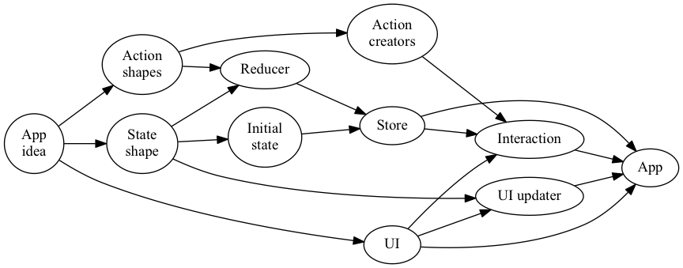
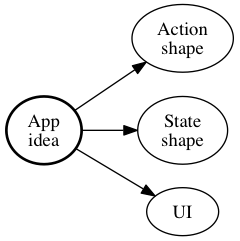
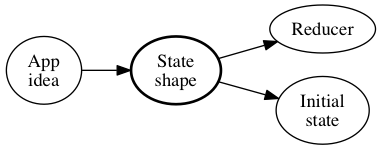
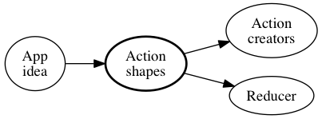
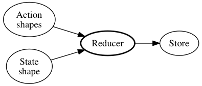
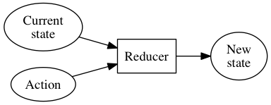
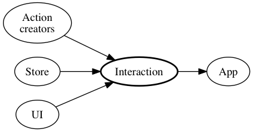
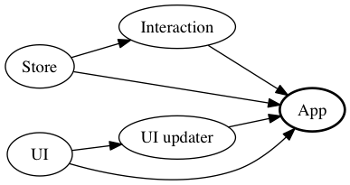

### The premise

We recently published a post that [explored Redux middleware](../exploring-redux-middleware/), based on Dan Abramov's [minimal Redux example](https://twitter.com/dan_abramov/status/664135757297295360). During the conversations following that post it became evident that however minimal the example is, there's room for an explanation of the how and why behind it. Which is exactly what this post provides - a **walkthrough of a basic Redux example**!

We'll be picking apart a super simple Redux app, only slightly bigger in scope than Dan's example. Like in his example there'll be no external dependencies - this will be a pure Redux experience.


### Our map



This is the journey we'll make throughout this post. It might look complicated, but don't fret - this isn't a map of the code but of **everything**, that is, the involved *ideas* and *concepts* as well as the code.

From here on, **each headline will correspond to a concept bubble** in the above map. For each concept we'll repeat a slice of the map showing the concepts that the current concept builds on, and what concepts it in turn is building up to.

### App idea

Before we can do anything, we need to have an **app idea** so we know what we're going to create! This will allow us to figure out a **UI**, the **action shapes** and **state shape**.



Let's make a simple **counter** app. The counter increases whenever the user clicks a **button**, by an amount controlled by an **input**. It should look something like this:


Essentially the same app that Dan built in his minimal example, except here we can increase by any amount and not just 1.


### State shape

Now that we have an **app idea**, let's decide on the **state shape**. That will in turn let us figure out what our **initial state** should be, as well as define our **reducer**.



In Redux, all the app state is contained in one single **object**.

However, in our simple counter app, we only need to track one single thing - the current count. Thus our state can be a **single number**.


### Initial state

Having decided on a **state shape**, however simple, we can now define an **initial state**. We'll need this to code our **store**.


For our little app that only entails one single decision - at what number should we start the count? Let's go with 0!

This also lets us write our first line of code:

```
var initialstate = 0;
```

### Action shapes

Let's design the **actions** needed for our **app idea**! We need them in order to make **action creators** and code the **reducer**.



In our app only one single thing can happen - **incrementing** the counter. Let's decide that the **action** describing this event looks like this:

```json
{
	type: 'INCREMENT',
	by: 3
}
```

In Redux all actions are described by **objects** with a mandatory `type` property, and eventual further data payload props. In our case just `by`.

<div class="smallnote">
Note: Normally we would isolate all string constants such as `"INCREMENT"` to a separate file, but in this simple example we'll live with having a single magic string like this.
</div>


### Reducer

Now that we have designed the **action shapes** and the **state shape** we can move on to define our **reducer**! With the reducer we'll be able to instantiate a **store**.



Remember: a **reducer** in Redux lingo is simply a function that takes the current state and an action, and returns a new state:



The reducer in our app just needs to deal with a single action, namely `INCREMENT`:

```javascript
var reducer = function(state,action){
	switch(action.type){
		case 'INCREMENT': return state + action.by;
		default: return state;
	}
};
```

When the `INCREMENT` action happens we create a new state by adding `action.by` to the current state.

<div class="smallnote">
Remember that we must **always** have a default case returning the current state, to deal with internal Redux startup actions.
</div>

<div class="smallnote">
Since our reducer deals with just a single action it would be better phrased as an `if-else`. We only used a `switch` because that's what a reducer normally looks like.
</div>

<div class="smallnote">
For more complex app we would write subreducers that each worked on parts of the state, and then combine them into one single reducer.
</div>

### Store

With the **initial state** and **reducer** in place, we can now create a **store** for our app state! That will let us code **interaction** for our **app**.


A store is instantiated using `Redux.createStore`:

```javascript
var store = Redux.createStore(reducer,initialstate);
```

<div class="smallnote">
We can also pass in an **enhancer** to `createStore`, commonly **middlewares**, but we don't need that here.
</div>

<div class="smallnote">
An alternative to providing an `initialstate` on store creation is to have a default return value inside the reducer.
</div>


### Action creators

Knowing the shape of the **actions** lets us define **action creators** to be consumed by our views to create **interaction**.


Only one single action creator is needed in our app.

```
var actionCreators = {
	increment: function(int){
		return {type: 'INCREMENT', by: int};
	}
};
```

Note how the action creator returns an action as previously defined.

<div class="smallnote">
Action creators are sometimes called "actions", which can cause some confusion as to the difference to actual action objects.
</div>

<div class="smallnote">
Action creators aren't strictly needed. Their main point is to provide a place to harbour eventual dispatch logic and save us from having to give our views access to the store.
</div>

<div class="smallnote">
In order to sanely define asynchronous actions we can use [Redux-thunk](https://github.com/gaearon/redux-thunk), a middleware which lets us return functions instead of actions from our action creators. We touch on this at the end of our [middleware post](../exploring-redux-middleware/).
</div>

### UI

Let's design the **UI** needed for our **app idea**. The next step will be to complete our **app** by introducing **ui updating**.


To create our UI we translate our mental screenshot...


...to this `html`:

```html
<body>
	<p>Counter is now at <span id="num"></span>.</p>
	<p>
		<button id="incbtn">Increase</button>
		<span> by </span>
		<input type="number" id="amount" value=1 />
	</p>
</body>
```

### UI updater function

Now that we now the **state shape** and the **UI**, we can define a **UI updater** function for our **app**!


The function updates the **UI** depending on the current **state**, which is passed in as an argument:

```javascript
var updateUI = function(state){
	var element = document.getElementById("num");
	element.innerHTML = state;
};
```

Since our **state** is just the current count, all we need to do is update the `#num` element with the `state`.

<div class="smallnote">
In a React app this would rather be a **render** function that defined the whole UI instead of mutating existing DOM.
</div>

### Interaction

Now we can complete our **app** by introducing **interaction** through hooking up the **action creators** to the **UI** and dispatch the result to the **store**!



We add a click handler to the **button**, which calls the **action creator** with the value from the **input**. The resulting action is passed to the **store**.

```javascript
var button = document.getElementById("incbtn");
button.addEventListener("click",function(){
	var input = document.getElementById("amount"),
		increase = parseInt(input.value),
		action = actionCreators.increment(increase);
	store.dispatch(action);
});
```

<div class="smallnote">
Normally you wouldn't let the views have a store reference like this, instead you'd use some kind of bridge to supply `dispatch` at setup time. In a React app you'd use the [React-Redux](https://github.com/reactjs/react-redux) library which provides exactly such a bridge.
</div>

### Application

We now have all the pieces we need to finalize our app!



The only code we need to add is to have **UI updater** run whenever the **store** is updated and also run an initial rendering.

```javascript
store.subscribe(function(){
	updateUI(store.getState());
});
updateUI(store.getState());
```

Now our app is fully functional!

Here is the entire source code: 

```html
<!DOCTYPE html>
<html>
<head>
  <meta charset="utf-8">
  <title>JS Bin</title>
  <script src="https://npmcdn.com/redux/dist/redux.js"></script>
</head>
<body>
	<p>Counter is now at <span id="num"></span>.</p>
	<p>
		<button id="incbtn">Increase</button>
		<span> by </span>
		<input type="number" id="amount" value=1 />
	</p>
<script type="text/javascript">

var initialstate = 0;

var reducer = function(state,action){
	switch(action.type){
		case 'INCREMENT': return state + action.by;
		default: return state;
	}
};

var store = Redux.createStore(reducer,initialstate);

var actionCreators = {
	increment: function(int){
		return {type: 'INCREMENT', by: int};
	}
};

var updateUI = function(state,arg2){
	var element = document.getElementById("num");
	element.innerHTML = state;
};

var button = document.getElementById("incbtn");
button.addEventListener("click",function(){
	var input = document.getElementById("amount"),
		increase = parseInt(input.value),
		action = actionCreators.increment(increase);
	store.dispatch(action);
});

store.subscribe(function(){
  updateUI(store.getState());
});
updateUI(store.getState());

</script>
</body>
</html>
```

And here is the app running in an iframe:

<iframe src="__STATIC__/applets/reduxminiexample" height="100px" width="100%"></iframe>


For your convenience there's also a JSBin [here](https://jsbin.com/milini/edit?html,js,output).

### The Redux cycle

Note how already this minimal example demonstrates the **unidirectional data flow**:


1. We click a button in our "component"
2. the component calls an action creator
3. the result is dispatched to the store
4. which uses the reducer to calculate a new state
5. which causes `updateUI` to update the "component"!

### Wrapping up

I realise the danger of this all being Much Ado About Nothing, but I hope that I to some extent was able to convey the Redux way of thinking. It is such a powerful paradigm once you've wrapped your head around it!

<div class="smallnote">
PS: This post is an (adapted) excerpt from a 2-day React+Redux training course that I provide through my employer Edument. So if you're in Scandinavia and hungry for more, [check it out](http://edument.se/en/training/webdevelopment/react-js)!
</div>