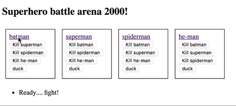
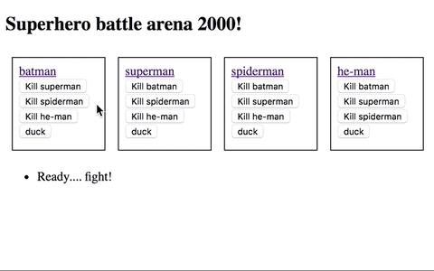
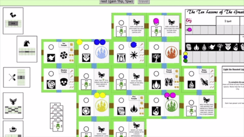

### The premise

In October 2015 we posted [A React-Redux example app](../a-react-redux-example-app/), still one of the most-read posts on this blog. Which, as is always the case when old code is scrutinized, feels increasingly embarrassing.

Even more so when Samuel Bleckley wrote a [comment pointing out a pretty severe bug](https://blog.krawaller.se/posts/a-react-redux-example-app/#comment-3035129301) in the example app! This blog post explains the bug and solves it, giving us a good excuse to discuss where to put logic in a Redux app:

1. In the view?
2. In the action creator?
3. In the reducer?
4. Somewhere else entirely?

### Reacquainting ourselves with the example

The [old source code](https://github.com/krawaller/riastart2015) is running in the iframe below (you can also access it directly at [https://blog.krawaller.se/riastart2015/](https://blog.krawaller.se/riastart2015/)).

<iframe src="https://blog.krawaller.se/riastart2015/" style="height:500px;width:100%"></iframe>

You're assumed to have read [the old blog post](a-react-redux-example-app/), but here's a whirlwind recap. The app state has two parts to it:

- `heroes` holds persistent information for each hero, such as number of kills total
- `battlefield` holds the state of the currently ongoing battle

As usual with Redux, each of these top-level keys has a reducer of its own, thus we have a `heroesReducer` and a `battlefieldReducer`.

You can see this more clearly by peeking at the [old initial state](https://github.com/krawaller/riastart2015/blob/gh-pages/src/initialstate.js) code:

```javascript
module.exports = function() {
  return {
    // "persistent" data on heroes
    heroes: {
      batman: {
        quote: "I'm batman.",
        kills: 0
      },
      superman: {
        quote: "I can fly!",
        kills: 0
      },
      spiderman: {
        quote: "Why don't you love me, Lois?",
        kills: 0
      },
      "he-man": {
        quote: "By the power of Grayskull!",
        kills: 0
      }
    },
    // data on the current battle
    battlefield: {
      doing: {
        batman: C.WAITING,
        superman: C.WAITING,
        spiderman: C.WAITING,
        "he-man": C.WAITING
      },
      standing: 4,
      log: ["Ready.... fight!"]
    }
  };
};
```

To see the persistent stats for a particular hero, simply click his name:



### The bug

The bug that Samuel Bleckley found is the embarrassing fact that kills are recorded even for shots that fail to take out their target. This happens if

- the target is ducking
- the target was killed by someone else first
- the shooter got taken out while aiming

Here you can see it in action - After the 2 second aiming period Batman gets a kill recorded even though Superman is ducking:



The explanation as to why this happens is pretty straightforward. Here is the [action creator](https://github.com/krawaller/riastart2015/blob/gh-pages/src/actions.js#L24-L32) that is called when we click a kill button:

```javascript
aimAt: function(killer,victim){
  return function(dispatch,getState){
    dispatch({type:constants.AIM_AT,killer:killer,victim:victim});
    setTimeout(function(){
      dispatch({type:constants.KILL_HERO,killer:killer,victim:victim});
    },2000);
  };
}
```

It synchronously dispatches `AIM_AT`, and then 2 seconds later, `KILL_HERO`. The effect of `KILL_HERO` is calculated in the [`battlefieldReducer`](https://github.com/krawaller/riastart2015/blob/gh-pages/src/reducers/battlefield.js#L26-L52):

```javascript
case C.KILL_HERO:
  if (state.doing[action.killer] === C.DEAD){
    newstate.log.push("The trigger finger twitches on "+action.killer+"'s corpse");
  } else {
    newstate.doing[action.killer] = C.WAITING; // whatever happens we should no longer be aiming
    // the target is ducking
    if (state.doing[action.victim] === C.DUCKING) {
      newstate.log.push(action.victim+" dodges a blast from "+action.killer+"!");
    // the target has already been killed
    } else if (state.doing[action.victim] === C.DEAD) {
      newstate.log.push(action.killer+" blasts "+action.victim+"'s corpse.");
    // we kill the target!
    } else {
      if (state.doing[action.victim]===C.AIMING){
        newstate.log.push(action.killer+" killed "+action.victim+" before he got his shot off!");
      } else {
        newstate.log.push(action.killer+" killed "+action.victim+"!");
      }
      newstate.doing[action.victim] = C.DEAD;
      newstate.standing = newstate.standing - 1;
      if (newstate.standing === 1){
        newstate.log.push(action.killer+" WINS!!");
      }
    }
  }
return newstate;
```

Zooming out, here's a map of the logic happening when we fire:


But since we branch between a valid kill and a spam message inside `battlefieldReducer`, there's no way for anyone else to distinguish between a kill and an attempted kill!

And this is our problem. The [`heroesReducer`](https://github.com/krawaller/riastart2015/blob/gh-pages/src/reducers/heroes.js) simply listens for the `KILL_HERO` action to register a kill:

```javascript
var newstate = Object.assign({}, state);
switch (action.type) {
  case constants.KILL_HERO:
    newstate[action.killer].kills += 1;
    return newstate;
  default:
    return state || initialState().heroes;
}
```

Initially there was no `AIM_AT` and no ducking - when you clicked kill, you instakilled your target. At that point in time, everything worked as expected. Then I added the 2-second aiming period and ducking, essentially _changing the meaning of the `KILL_HERO` action to `MAYBE_KILL`_.

With the current setup, there isn't really a simple way to solve this! The `heroesReducer` only cares about actual kills, but cannot easily differentiate those since the branching is done inside the `battlefieldReducer`.

### Solving the problem

Here's a fixed version of the app! Note how failed shots won't register as kills here.

<iframe src="https://blog.krawaller.se/reactreduxexamplev2/" style="height:500px;width:100%"></iframe>

The new source code - which, apart from the bug fix, also has updated dependencies, an ES6 makeover and some reorganisation - is available at [https://github.com/krawaller/reactreduxexamplev2](https://github.com/krawaller/reactreduxexamplev2).

We squashed the bug by updating the [action creator](https://github.com/krawaller/reactreduxexamplev2/blob/gh-pages/src/actions.js#L25-L51), making it host the main branching logic:

```javascript
if (state.doing[killer] === C.DEAD) {
  dispatch({ type: C.TWITCH_FINGER, who: killer });
} else {
  // the target is ducking
  if (state.doing[victim] === C.DUCKING) {
    dispatch({ type: C.MISS_SHOT, killer, victim });
    // the target has already been killed
  } else if (state.doing[victim] === C.DEAD) {
    dispatch({ type: C.BLAST_CORPSE, killer, victim });
    // we kill the target!
  } else {
    dispatch({ type: C.KILL_HERO, killer, victim });
  }
}
```

The `battlefieldReducer` has corresponding [new action cases](https://github.com/krawaller/reactreduxexamplev2/blob/gh-pages/src/store/reducers/battlefield.js#L29-L39)...

```javascript
case C.TWITCH_FINGER:
  newstate.log.push("The trigger finger twitches on "+action.who+"'s corpse");
  return newstate;
case C.MISS_SHOT:
  newstate.doing[action.killer] = C.WAITING;
  newstate.log.push(action.victim+" dodges a blast from "+action.killer+"!");
  return newstate;
case C.BLAST_CORPSE:
  newstate.doing[action.killer] = C.WAITING;
  newstate.log.push(action.killer+" blasts "+action.victim+"'s corpse.");
  return newstate;
```

...and an [updated `KILL_HERO` case](https://github.com/krawaller/reactreduxexamplev2/blob/gh-pages/src/store/reducers/battlefield.js#L40-L52):

```javascript
case C.KILL_HERO:
  if (state.doing[action.victim]===C.AIMING){
    newstate.log.push(action.killer+" killed "+action.victim+" before he got his shot off!");
  } else {
    newstate.log.push(action.killer+" killed "+action.victim+"!");
  }
  newstate.doing[action.victim] = C.DEAD;
  newstate.doing[action.killer] = C.WAITING;
  newstate.standing = newstate.standing - 1;
  if (newstate.standing === 1){
    newstate.log.push(action.killer+" WINS!!");
  }
  return newstate;
```

Now `KILL_HERO` actually means what it says again.

### Discussing our options

Looking again at our four options for placing logic in Redux:

1. In the view?
2. In the action creator?
3. In the reducer?
4. Somewhere else entirely?

Option 1 is almost always wrong. We want to keep our views simple and as decoupled from the business logic as possible. You should be able to switch framework without doing any business logic reworkings at all!

Option 2 is often right, especially when you aren't sure. Don't be afraid to have fat action creators and small reducers! See the sum of them as your business logic. I saw a quote which I cannot find now, but which said that

> You should be able to fully understand an app by looking at its [Redux] reducers.

I disagree - the quote should be

> You should be able to fully understand an app by looking at its [Redux] reducers and action creators.

In the case of my little example app, option 3 was wrong for the shot consequence calculation. Because a reducer cared about the goings-on inside another reducer I had painted myself into a corner.

What about option 4? Recently I made a web version of the print &amp; play demo of the board game [Tiny Epic Quest](https://boardgamegeek.com/boardgame/201921/tiny-epic-quest), to support its [Kickstarter campaign](https://www.kickstarter.com/projects/coe/tiny-epic-quest-introducing-itemeeplestm/). Here you can see the web app in action:



Each player commands a group of adventurers that roam around the map, solve quests, gain items, adventure into temples, battle goblins, etc. You can probably imagine that the business logic for this is very complex!

Before I sat out, I naturally expected the Redux parts of my app to be very heavy. Yet here is my entire `battleReducer`:

```
function battleReducer(currentstate,action){
  let newstate = augmentBattle(cloneDeep(currentstate || initialState.battle))
  switch(action.type){
    case C.START_GAME: return console.log('act',action) || goToMode(startBattle(action.seating, action.layout, action.startingQuests),C.MODE_GENERATE_BOARD)
    case C.SELECT_TRAVEL: return makeChoice(newstate, 'travel', action.travel)
    case C.SELECT_UNIT: return makeChoice(newstate, 'unit', action.unit)
    case C.SELECT_SECTION: return makeChoice(newstate, 'section', action.section)
    case C.SELECT_GOBLIN: return makeChoice(newstate, 'goblin', action.goblin)
    case C.SELECT_QUEST: return makeChoice(newstate, 'quest', action.quest)
    case C.SELECT_COMMAND: return newstate.commands[action.command].effect(newstate,action.arg)
    default: return newstate;
  }
};

```

As you might gather, the actions correspond to interactions with the UI - this is a list of all the different categories of items that a user can click on. Which also means that the action creators are similarly simple. So, then, where is the logic?

It lives in a gargantuan object of "modes". Each mode is a specific point in the game, and defines what input it requires, what commands are available and what happens when they are called. As an example, here's the mode for when we've visited a mushroom village to get some help battling goblins:

```javascript
[C.MODE_VILLAGE_HIT2]: {
  setup: b=> {
    if (!Object.keys(activeGoblinTargets(b)).length){
      return goToMode(b,C.MODE_CHECK_QUESTS)
    }
    return b
  },
  instruction: b=> "Deal 2 dmg to a goblin one of your heroes are fighting!",
  options: {
    goblin: activeGoblinTargets
  },
  commands: (b)=> ({
    hit: {
      available: b=> b.choices.goblin,
      effect: b=> {
        b = pokeGoblin(b)
        return goToMode(b,C.MODE_CHECK_QUESTS)
      }
    },
    skip: {
      effect: b=> goToMode(b,C.MODE_CHECK_QUESTS)
    }
  })
}
```

In other words, the business logic is spearated not just from the views (React), but also from the data layer (Redux)! In a bout of nostalgia I could switch out Redux for Reflux, and I wouldn't have to touch my business code.

### Wrapping up

Now, I'm not saying that option 4 rulez all, and that you should go forth to separate the business logic from Redux like this. But there are times when it has merits, and I think there is value just in realising that there _are_ 4 options and not just 3!

And, again - don't be afraid of fat action creators!
