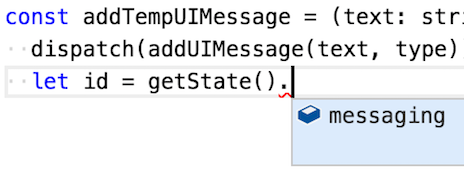
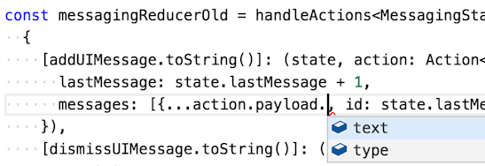
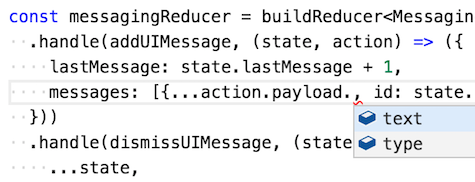

### The premise

This post will explore a Redux TypeScript setup, using a tiny project as an example. My intention was to use this as a starting point whenever I start a new project, which so far has worked very well.

Apart from Redux we'll also use `redux-actions` and `redux-thunk`.

There's also a React part to this project, but I'll leave exploring that to an upcoming post. This one will revolve solely around TypeScript and Redux.


### The scaffold state

Here's the `AppState` for my little example project:

```typescript
type AppState = {
  messaging: MessagingState;
  /* ...imagine other domains here... */
};
```

Normally an app state would of course contain lots of top-level keys, but here I just have `messaging`, meant to deal with app-wide feedback to the user. While skinny, this will still be enough to get the TypeScript setup points across.

`MessagingState` looks like this:

```typescript
type MessagingState = {
  lastMessage: number;
  messages: UIMessage[];
};
```

In other words, `appState.messaging.messages` is an array of `UIMessage` feedback items. They look like this...

```typescript
type UIMessage = {
  id: number;
  text: string;
  type: UIMessageType;
};
```

...and `UIMessageType` is simply an enum:

```typescript
type UIMessageType = 'info' | 'success' | 'error';
```

The `lastMessage` part of `MessagingState` is used to create the ID for new messages, as well as fetching a reference to the last one. Normally I'd do that as a computed property with [Reselect](https://github.com/reactjs/reselect), but I didn't want to muddy the waters too much here.

Finally we make an `initialState` to seed our store with, containing a welcoming UI message:

```typescript
const initialState: AppState = {
  messaging: {
    messages: [{type: 'info', text: 'Welcome!', id: 1}],
    lastMessage: 1
  }
};
```

### Action creators

I wanted to use [Redux-Actions](https://github.com/acdlite/redux-actions), a pretty neat helper library to reduce boilerplate. Make sure to also get the [typings](https://github.com/DefinitelyTyped/DefinitelyTyped/blob/master/types/redux-actions/index.d.ts) (`@types/redux-actions`).

`ReduxActions` uses the [Flux Standard Action](https://github.com/acdlite/flux-standard-action) format, meaning an action looks like this:

```typescript
interface Action<Payload> {
  type: string;
  payload?: Payload;
  error?: boolean;
}
```

In other words, eventual data passed with the action should go in the `payload` prop. The advantage of that is that we can simplify the API of action creators, as has been done in `ReduxActions` with the `createAction` helper.

In my simple scaffolding app there are only two possible actions; **adding a message** and **removing a message**.

Here's `addUIMessage(text, type)`:

```typescript
type addUIMessagePayload = {
  text: string;
  type: UIMessageType;
};
const addUIMessage = createAction<addUIMessagePayload, string, UIMessageType>(
  ADD_UI_MESSAGE, (text, type) => ({text, type})
);
```

The `ADD_UI_MESSAGE` variable is merely a constant with the string, presumably imported from a `constants` file.

The signature of `createAction` looks like this:

```typescript
createAction<TPayload, TArg1, TArg2, ...>(
  STRINGCONSTANT, arg1, arg2, ...
) => TPayload
```

Note how the creator just needs to return the payload, not the full action object.

We `dismissUIMessage(id)` like this:

```typescript
type dismissUIMessagePayload = number;
const dismissUIMessage = createAction<dismissUIMessagePayload, number>(
  DISMISS_UI_MESSAGE, id => id
);
```

Here the payload is just the id of the message to dismiss.

The `createAction` helper also does another clever thing - it sets up the `.toString` method on the creator to return the action string type. In other words:

```typescript
dismissUIMessage.toString() // DISMISS_UI_MESSAGE
```

We'll utilise this fact later on.

### Thunk actions

What about creating thunks to work with the [ReduxThunk](https://github.com/gaearon/redux-thunk) middleware? Say we want to add a third action creator, `addTempUIMessage(text, type)`, which adds a message that dismisses itself after a few seconds. Implementing it is easy enough, but how do we get type support?

Here's what it looks like with the official [ReduxThunk typings](https://github.com/gaearon/redux-thunk/blob/master/index.d.ts) (bundled with the library so no `@types` required):

```
import { ThunkAction } from 'redux-thunk';

const addTempUIMessage = 
  (text: string, type: UIMessageType): ThunkAction<null, IState, null> =>
    (dispatch, getState) => {
      dispatch(addUIMessage(text, type));
      let id = getState().messaging.lastMessage;
      setTimeout(() => dispatch(dismissUIMessage(id)), 2000);
    };
```

Under the hood `ThunkAction` uses the [official Redux typings](https://github.com/reactjs/redux/blob/master/index.d.ts), which also comes bundled.

The `ThunkAction` gets `<ReturnVal, AppState, ExtraAPI>` passed in. Some like to have `ReturnVal` be a promise, and `ExtraAPI` deals with the [new `thunk.withExtraArgument(api)` feature](https://twitter.com/dan_abramov/status/730053481919303685) added last year.

The main win from using `ThunkAction` is that it will correctly type `dispatch`, `getState` and the return value of `getState`:



I had good help of the discussion in [this `redux-thunk` issue](https://github.com/gaearon/redux-thunk/issues/103) when wrapping my brain around this.

Since it is likely my thunk creators will all look the same, I set up an app-specific helper type...

```
type Thunk = ThunkAction<void, AppState, void>;
```

...which makes the code prettier still:

```
const addTempUIMessage = 
  (text: string, type: UIMessageType): Thunk =>
    // ...rest same as before
```

### Reducer

We build our top-level reducer by combining subreducers for each domain as usual:

```typescript
import { combineReducers } from 'redux';
const reducer = combineReducers<AppState>({
  messaging: messagingReducer,
  // ...imagine lots more reducers here...
});
```

Note how the Redux typings let us pass our `AppState` type to `combineReducers`.

So how are the individual reducers constructed? In bare-bones Redux we simply make a pure function with a big `switch` statement. `ReduxActions` however has a `handleActions` helper that makes for less cruft. Here's how we can use that to make a reducer dealing with the two message-related actions:

```typescript
const messagingReducer = handleActions<MessagingState>(
  {
    [addUIMessage.toString()]: (state, action: Action<addUIMessagePayload>): MessagingState => ({
      nextId: state.nextId + 1,
      messages: [{...action.payload, id: state.nextId}].concat(state.messages)
    }),
    [dismissUIMessage.toString()]: (state, action: Action<dismissUIMessagePayload>): MessagingState => ({
      ...state,
      messages: state.messages.filter(m => m.id !== action.payload)
    })
  },
  initialState.messaging
);
```

Note how we use the `.toString` of the action creators, saving us from having to import the constants.

And through the `Action<actionCreatorPayload>` typing we get the correct type for `action.payload` inside the handler:



This is kind of neat, but there are still two drawbacks here:

* The typings don't cascade, we have to add `MessagingState` at the top and at every individual handler
* We have to reference the action creators in both the key and the value, leaving room for mismatches.

The first point is discussed in [this ReduxActions PR](https://github.com/acdlite/redux-actions/issues/84), where [Leon Yu](https://github.com/leonyu) explains that the dictionary form prevents type cascade. He then suggests a builder-like solution, which also happens to solve the second point!

Here's how my implementation of his idea is used:

```typescript
const messagingReducer = buildReducer<MessagingState>()
  .handle(addUIMessage, (state, action) => ({
    lastMessage: state.lastMessage + 1,
    messages: [{...action.payload, id: state.lastMessage + 1}].concat(state.messages)
  }))
  .handle(dismissUIMessage, (state, action) => ({
    ...state,
    messages: state.messages.filter(m => m.id !== action.payload)
  }))
  .done();
```

Far fewer typings (we don't even need to import the action payload types!), no room to connect the wrong handler with the wrong type, and still full support for state, payload and return type:



Granted, having to call `.done()` at the end might feel a bit boilerplaty, but I still much prefer this helper to the `handleActions` one from `ReduxActions` shown earlier.

Here's the source code for the `buildReducer` helper:

```typescript
import { Reducer, Action } from 'redux-actions';
import { ActionCreator } from 'redux';

type builderObject<TState> = {
  handle: <TPayload>(
    creator: ActionCreator<Action<TPayload>>,
    reducer: Reducer<TState, TPayload>
  ) => builderObject<TState>,
  done: () => Reducer<TState, Action<any>>
};

function buildReducer<TState>(): builderObject<TState> {
  let map: { [action: string]: Reducer<TState, any>; } = {};
  return {
    handle(creator, reducer) {
      const type = creator.toString();
      if (map[type]) {
        throw new Error (`Already handling an action with type ${type}`);
      }
      map[type] = reducer;
      return this;
    },
    done() {
      const mapClone = Object.assign({}, map);
      return (state: TState = {} as any, action: Action<any>) => {
        let handler = mapClone[action.type];
        return handler ? handler(state, action) : state;
      };
    }
  };
}
```

### The store

If we just create the store directly with `createStore`, the type will be inferred from the reducer (even if we didn't have initial state):


When using an enhancer such as created by `applyMiddleware`, we must type the variable ourselves:

```
const store: Store<AppState> = applyMiddleware(thunk, logger)(createStore)(reducer, initialState);
```

But since that's only ever done once, that isn't really an issue.

As for the middlewares themselves, Redux has a `MiddlewareAPI<S>` typing. So with a tiny app-specific helper type...

```
type API = MiddlewareAPI<AppState>;
```

...we can type the middlewares:

```
import {  }
const logger = (api: API) => next => action => {
  console.log('dispatching', action.type, action);
  let result = next(action);
  console.log('next state', api.getState());
  return result;
};
```


### Wrapping up

I'm pretty happy with this setup - not much typings necessary, but I still get full TypeScript support throughout.

There are some itches I'd like to scratch further. For example, having to feed the action creator argument types up top to `createAction` is a bit iffy:

```typescript
const addUIMessage = createAction<addUIMessagePayload, string, UIMessageType>(
  ADD_UI_MESSAGE, (text, type) => ({text, type})
);
```

I would much prefer to do this:

```typescript
const addUIMessage = createAction<addUIMessagePayload>(
  ADD_UI_MESSAGE, (text: string, type: UIMessageType) => ({text, type})
);
```

This should be doable, I need to explore further.

Also I'm looking at exposing the actions on the store instance instead of having a `dispatch` function and a separate `action` object. Why let the user ever dispatch anything except what is born from an action creator?

Finally the `Middleware` typings are lacking. I'd like to do something like this up top:

```
const logger: Middleware<AppState> = // ...
```

...and just have everything below it, including `next` and `action`, be correctly inferred. But as middlewares are few and one-off, setting that up isn't really a priority.

Anyhow - I hope this setup is of use to you too, and if you have any feedback, please do comment or reach out! 

And as initially stated, I'll detail the React parts of my setup in an upcoming post.

