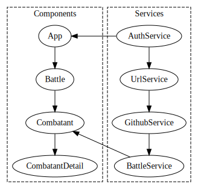

### The premise

This blog post contains a small case study using [Angular](https://angular.io/) (v4), the [Github API](api.github.com) and [Firebase authentication](https://firebase.google.com/docs/auth/).

The app is [Github Battle](http://githubbattle.netlify.com/), a tiny app that lets you enter Github user names to see who has the most stars. Try it out below!

<iframe src="__STATIC__/applets/githubbattle" style="height:400px;width:100%;"></iframe>

You can also access the app directly [here](http://githubbattle.netlify.com/), and the github repo is [here](https://github.com/krawaller/githubbattle).

It was built for use in the [Angular course](https://edument.se/education/categories/webdevelopment/the-new-angular) I made for my employer [Edument](https://edument.se). The purpose was to:

* demonstrate component-service relations
* show off Firebase authentication
* provide advanced stream juggling examples
* provoke discussions about RESTful API:s

Note that we use the Firebase authentication only as a convenient Github login, and we only log in to get around the rate limit for the Github API. The actual identity of the logged in user is never used.

### The construction

The [source code](https://github.com/krawaller/githubbattle) is commented and not very big in scope, but here's a quick overview and walkthrough:

The top-level [App component](https://github.com/krawaller/githubbattle/blob/master/components/app.ts) handles the login functionality, by utilising features exposed by the [Auth service](https://github.com/krawaller/githubbattle/blob/master/services/authservice.ts). The Auth service owns the authentication state, and is the only place in the app referencing Firebase.

When the user is logged in the App component renders a [Battle component](https://github.com/krawaller/githubbattle/blob/master/components/battle.ts). The Battle component doesn't do much beyond rendering two [Combatant components](https://github.com/krawaller/githubbattle/blob/master/components/combatant.ts), and highlighting the one with the most stars (when both have loaded user data).

The [Combatant components](https://github.com/krawaller/githubbattle/blob/master/components/combatant.ts) contains the form that lets the user enter a Github user name. It will use the [Battle service](https://github.com/krawaller/githubbattle/blob/master/services/battleservice.ts) to load the data for that user, and show it with a [Combatant detail component](https://github.com/krawaller/githubbattle/blob/master/components/combatantdetail.ts). It will also emit the star count to the parent.

The [Battle servie](https://github.com/krawaller/githubbattle/blob/master/services/battleservice.ts) used by the Combatant component will in turn use the [Github service](https://github.com/krawaller/githubbattle/blob/master/services/githubservice.ts) to make the actual requests to the Github API. In effect the Battle service is a middle man, whose main job it is to shape the data into the form that the Combatant component needs.

The Github service is the one making ajax requests to the Github API. It also has a dependency, namely the [UrlService](https://github.com/krawaller/githubbattle/blob/master/services/urlservice.ts), which has static methods to create URL:s for specific requests. In order to do that it uses the Auth service, since we must add the token of the logged in user to the URL in order to get around Github's rate limit for their API.

### Wrapping up

...and that's it! The source code is pretty straight forward, but it has served me well as an example when teaching the course, so I put it on here in hope that others might find it useful.

If you see something wrong or amiss, please, let me know below or make an issue/PR on the [repo](https://github.com/krawaller/githubbattle)!
