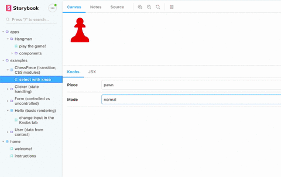
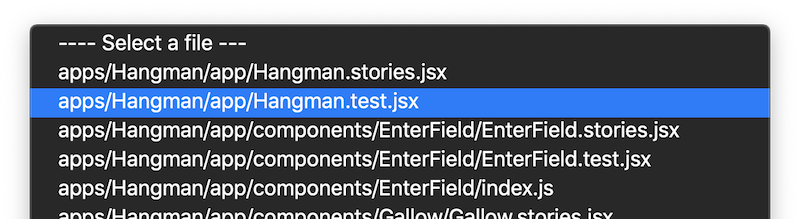
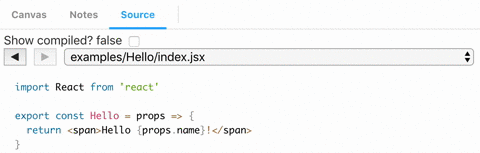

### Premise

It took me a while to realise, but - [Storybook](https://storybook.js.org/) is super awesome! At first I thought it's just a tool to display a library of UI components, which it also is, but that's not the real value. Storybook lets you test run components in isolation as you build them, and thereby also encourage you to develop them in a decoupled way.

When teaching [Edument's React courses](https://edument.se/en/education/courses/query?q=react&category=&location=) I have a collection of small demos to show off React's various features. They lived in a homebrewed platform that had some nice feautes, but now I thought - why not serve them in a Storybook?

So I did, and it was glorious. But, there was one feature from my old platform that Storybook didn't have; I couldn't show the source code next to the running demo. There is an [addon to show the source of the story itself](https://github.com/storybookjs/storybook/tree/master/addons/storysource), but that's not nearly enough - I need to show the code for the component that they import!

Since the source view was a very appreciated feature, I went ahead and built it into my Storybook. This post walks through how this was done!



Our Storybook is deployed live at [https://edument-react-examples.netlify.com/](https://edument-react-examples.netlify.com/), and the repo is at [https://github.com/edumentab/react-examples-storybook](https://github.com/edumentab/react-examples-storybook).

### Gearing up

Remember that [classic XKCD strip](https://xkcd.com/208/) about saving the day with regular expressions?


As a curious nerd - and expecially one with an academic background - I frequently find myself deep down rabbit holes with a vague awareness that "ok, this is super neat, but I'll never get to use it".

One such rabbit hole was exploring how Webpack [loaders](https://webpack.js.org/contribute/writing-a-loader/) and [plugins](https://webpack.js.org/contribute/writing-a-plugin/) actually work. But, lo and behold, now I found use for them!

### Reading the source code

My idea was very simple - hack Storybook's webpack setup with a loader that simply **saves the source code to somewhere** as the files are read.

However, we don't want to have _all files_, for example everything in `node_modules` should be excluded. So I simply pass in a `root` source to the loader in the Storybook webpack config...

```javascript
config.module.rules.push({
  test: /\.jsx?$|\.css$/,
  use: [
    {
      loader: path.resolve(__dirname, "sourceCodeUtils/sourceLoader.js"),
      options: { root: path.resolve(__dirname, "../src") }
    }
  ]
});
```

...which the loader then uses to know what to remember:

```javascript
function sourceLoader(source) {
  const opts = this.query || {};
  const { root = "" } = opts;
  const path = this.resourcePath;
  if (path.match(root)) {
    cache.register(path.substr(root.length).replace(/^\//, ""), source);
  }
  return source;
}
```

Now my cache (which is just a super-simple in-memory object) will contain the source of all files I'm interested in!

### Providing the source

Now we need to catch the sources saved by the loader! That is done in a **webpack plugin**:

```javascript
class SourcePlugin {
  apply(compiler) {
    compiler.hooks.emit.tapAsync(
      "Source Code Plugin",
      (compilation, callback) => {
        const sources = JSON.stringify(cache.getSources());
        compilation.assets["rawSources.json"] = {
          source: () => sources,
          size: () => sources.length
        };
        callback();
      }
    );
  }
}
```

From my cache I'll get an object with filenames as keys and source codes as values. I simply take that object and inject it into the assets as `rawSources.json`.

### Adding the source code tab

Next up is adding a "tab" in Storybook to display the source! This is done through the Storybook addon API:

```javascript
// Called from the `addons.js` setup file
addonAPI.register("edumentab/sourcecode", storybookAPI => {
  const channel = addonAPI.getChannel();

  // making the source code available
  fetch("./rawSources.json")
    .then(response => response.json())
    .then(data => channel.emit("sourceCode/rawSources", data));

  // adding the tab with the sourcecode
  addonAPI.add("edumentab/sourcecode/panel", {
    type: types.TAB,
    title: "source",
    route: ({ storyId }) => `/sourceCode/${storyId}`,
    match: ({ viewMode }) => viewMode === "sourceCode",
    render: ({ active }) => {
      return React.createElement(SourcePanel, {
        channel: addonAPI.getChannel(),
        storybookAPI,
        active
      });
    }
  });
});
```

The `SourcePanel` component receives the addons `channel`, from which the sources will be emitted when `rawSources.json` has been fetched.

### Showing the source code

Inside the `SourcePanel` React component we catch the emission from `channel`, and let the user select which file to view with a dropdown!

That means we have two pieces of local state:

- The source files, updated through a subscription on `channel` created in a `useEffect` call
- What file is currently selected

And we render just two things:

- A `<select>` dropdown to select the file
- A `<Highlighter>` component to show the current file, using the excellent ['react-syntax-highlighter'](https://github.com/conorhastings/react-syntax-highlighter#readme) package.

```javascript
const SourceCodePanel = props => {
  const { channel, storybookAPI } = props;
  const [filePath, setFilePath] = useState(null);
  const [rawSources, setRawSources] = useState(null);
  const handleDropdownChange = e => setFilePath(e.target.value);
  useEffect(() => {
    channel.on("sourceCode/rawSources", setRawSources);
  });
  if (!props.active) return null;
  if (!rawSources) return <span>...loading...</span>;
  return (
    <Fragment>
      <select onChange={handleDropdownChange} value={filePath}>
        <option> ---- Select a file ---</option>
        {files.map(file => (
          <option value={file} key={file}>
            {file}
          </option>
        ))}
      </select>
      <Highlighter
        language={filePath.match(/.css$/) ? "css" : "javascript"}
        code={rawSources[filePath]}
        onLinkClick={handleLinkClick}
      />
    </Fragment>
  );
};
```

### Switching source file on story change

This is already rather neat! But, as a user, I expect the source tab to reflect the story that I'm currently viewing. In other words, we need to change source file whenever a story is changed.

There is of course a central event for story change available, but that turned out to be insufficient since it doesn't contain the name of the source file! Thus we don't know which file to switch to.

My solution was to make a second storybook addon - a decorator that simply emits the story file info upon selection:

```javascript
import addons, { makeDecorator } from "@storybook/addons";

export const emitSourcePathDecorator = makeDecorator({
  name: "withSourceInfo",
  parameterName: "sourceCode",
  wrapper: (getStory, context, { parameters }) => {
    const channel = addons.getChannel();
    channel.emit("sourceCode/selectedStory", context.parameters.fileName);
    return getStory(context);
  }
});
```

In our central Storybook `config.js` we make sure this decorator is applied to every story:

```javascript
import { configure, addDecorator } from "@storybook/react";
import { withKnobs } from "@storybook/addon-knobs";
import emitSourcePathDecorator from "./sourceCodeUtils/emitSourcePathDecorator";

function loadStories() {
  const req = require.context("../src", true, /\.stories\.jsx$/);
  addDecorator(withKnobs);
  addDecorator(emitSourcePathDecorator); // <-- our filePath addon
  req.keys().forEach(filename => req(filename));
}

configure(loadStories, module);
```

Finally, in our panel, we add another `useEffect` that subscribes to the filepath event:

```javascript
useEffect(() => {
  channel.on("sourceCode/selectedStory", path => {
    if (rawSources) {
      const file = matchPathToSource(path);
      if (file) {
        setFilePath(file);
      }
    }
  });
  return () => channel.removeListener("sourceCode/selectedStory");
}, [rawSources]);
```

The `matchPathToSource` function is a simple helper that finds the corresponding key in the `rawSources` object, if any.

### Making import links clickable

A really neat feature that you might have noticed in the GIF up top is that we can also change selected source file by clicking an import statement!

This was rather easy to add thanks to the excellent hackability of the `react-syntax-highlighter` package.

I first made a `mapChild` function that would receive all nodes in the source code output. The function will identify all import paths and expose their links as a `data-link` attribute.

```javascript
const matchRelPath = /^["']\..*['"]/;

function mapChild(node, i, row) {
  const extraProps = {};
  if (i > 3) {
    const content = ((node.children || [])[0] || {}).value || "";
    if (
      // text content looks like a relative path
      content.match(matchRelPath) &&
      // prior node is a space
      ((row[i - 1].children || [])[0] || {}).value === " " &&
      // node 2 steps down is a `from` keyword
      ((row[i - 2].children || [])[0] || {}).value === "from"
    ) {
      return {
        ...node,
        properties: {
          ...node.properties,
          // expose the link path as an attribute so we can easily find it
          "data-link": content.replace(/^['"]|['"]$/g, "")
        }
      };
    }
  }
  return node;
}
```

We then use that function in a custom renderer that we pass to `SyntaxHighlighter`:

```javascript
<div className="source-code" onClick={handleLinkClick}>
  <SyntaxHighlighter
    style={prism}
    language={language}
    renderer={({ rows, stylesheet, useInlineStyles }) => {
      return rows.map((row, i) => {
        const children = row.children.map(mapChild);
        const link = children.find(
          child => (child.properties || {})["data-link"]
        );
        return createElement({
          node: {
            ...row,
            properties: {
              ...row.properties,
              className: [],
              ...(link && {
                "data-link-row": link.properties["data-link"]
              })
            },
            children: row.children.map(mapChild)
          },
          stylesheet,
          useInlineStyles,
          key: `code-segement${i}`
        });
      });
    }}
  >
    {code}
  </SyntaxHighlighter>
</div>
```

In the renderer we mark every import statement row with a `data-link-row` attribute (since we want the entire row to be clickable, not just the string with the path).

Finally we use that attribute in the `handleLinkClick` click handler that we wrapped the entire source code with:

```javascript
const handleLinkClick = useCallback(
  e => {
    const link =
      e.target.getAttribute("data-link-row") ||
      e.target.parentNode.getAttribute("data-link-row");
    if (link) {
      onLinkClick(link);
    }
  },
  [onLinkClick]
);
```

The `onLinkCLick` method here is simply the `setFilePath` method from our Panel, that has been passed down as a prop.

### Including source code for test files

Since all of our React demos have associated unit tests, I wanted to expose those files as well in the source code viewer. But how could I do that? They are not imported by Storybook, which means they never pass through our custom webpack setup!

The solution turned out to be very simple! First we edit our central `config` to target both story files and test files:

```javascript
const req = require.context("../src", true, /\.stories\.jsx$|\.test\.jsx?/);
```

Then, make sure the test code isn't executed (which would throw errors) by a simple tweak to the return statement in our custom webpack loader:

```javascript
return path.match(".test.") ? "" : source;
```

The test files will still be included in the bundle, but as empty strings that have no effect. And the test files are now available for viewing in our source code panel!



### Showing both uncompiled and compiled source

Another cheap but cute feature we added was a toggle to show the code both before and after the babel compilation:



We accomplished this simply by including our custom webpack loader two times, once before and once after the babel loader. The second time we pass a `compiled: true` flag.

```javascript
config.module.rules.push({
  // will run before Babel
  test: /\.jsx?$|\.css$/,
  use: [
    {
      loader: path.resolve(__dirname, "sourceCodeUtils/webpackLoader.js"),
      options: { root: path.resolve(__dirname, "../src") }
    }
  ]
});
config.module.rules.unshift({
  // will run after babel
  test: /\.jsx?$|\.css$/,
  use: [
    {
      loader: path.resolve(__dirname, "sourceCodeUtils/webpackLoader.js"),
      options: {
        root: path.resolve(__dirname, "../src"),
        compiled: true
      }
    }
  ]
});
```

The loader passes the `compiled` flag on to the cache...

```javascript
cache.register(path.substr(root.length).replace(/^\//, ""), source, compiled);
```

...which now maintains a `{ compiled: string, raw: string }` object per file path.

In the source code panel we now track a bool for whether we're watching compiled code or not...

```javascript
const [showCompiled, setShowCompiled] = useState(false);
```

...which we use to decide what code to pass to the `Highlighter`:

```javascript
<Highlighter
  code={(rawSources[filePath] || {})[showCompiled ? "compiled" : "raw"] || ""}
```

### Wrapping up

We've also implemented a history of viewed files so that you can go "back" to the previous file, hot reloading support, and some other minor features, and there are plans for more still.

But this post has now covered the meat of it, which I hope will prove useful in your own Storybook-hacking adventures!

Here are the links again:

- Live storybook: [https://edument-react-examples.netlify.com/](https://edument-react-examples.netlify.com/)
- Git repo: [https://github.com/edumentab/react-examples-storybook](https://github.com/edumentab/react-examples-storybook)
